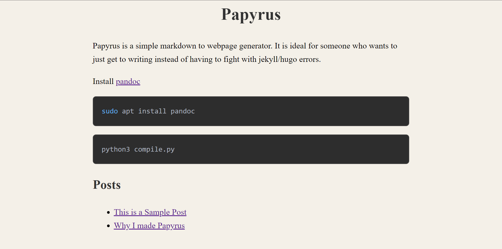

# Papyrus



Papyrus is a simple markdown to webpage generator. It is ideal for someone who wants to just get to writing instead of having to fight with jekyll/hugo errors.

Install [pandoc](https://pandoc.org/installing.html)
```bash
sudo apt install pandoc
```

```bash
python3 compile.py
```